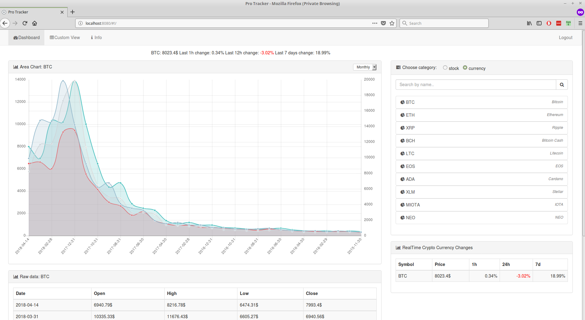

# Human Computer Interaction

### About Application

Application enables us to quickly and easily track stocks or crypto currencies.
With this application, the users who are dealing with the stock or crypto currencies exchange can quickly and easily check their status.
Data can be tracked on graphs and tables, where there is the possibility of tracking multiple stocks or crypto currencies, and comparing their values.

Stocks Parameters

First of all, we note that each stock/currency has its own symbol,
which is a short name of stock/currency such as the MCD for McDonald's Corporation.

In addition to the time parameter, stocks have more parameters
that we will briefly explain for easier understanding:

   - Open: The price at the beginning of the trading day,
   - High: The highest price the stock reached during the day,
   - Low: The lowest price reached during the day,
   - Close: The final price.

### Technologies:

   - Java 7
   - Spring
   - AngularJS
   - Bootstrap
    
### API:
   - [AlphaVantage](https://www.alphavantage.co/documentation/#)
   - [CoinMarketCap](https://coinmarketcap.com/api/)

### IDE:
   - IntelliJ IDEA

### App Screenshots: 

### Dashboard

